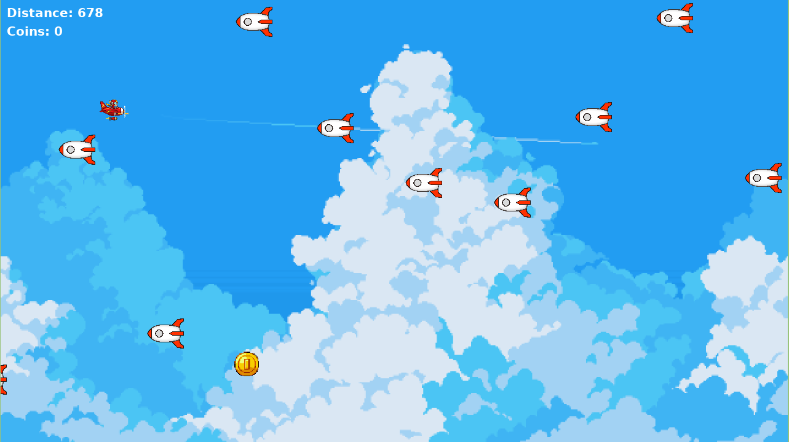

<h1 align="center">Plane game</h1>


<p align="center">
    Just a plain plane game made with Pygame. This is a simple game where you control a plane and avoid obstacles. The purpose of this project is to learn Pygame and implementing OOP as best as possible in Python.
</p>

## Screenshoots
<p align="center">
  
</p>

## Library, Frameworks & Tools Used

- [Python 3.11](https://www.python.org/)
- [Pygame](https://www.pygame.org/)

## Setup & Run
if you want to run the game, continue or modify this project, you can follow these steps:
- Clone this project

```bash
git clone https://github.com/jo0707/planegame
```

- open the directory in your IDE/Text Editor. Or change directory to the project
```bash
cd planegame
```

<b>Make sure you have Python 3.11 installed on your machine</b>

<i>(another version of Python may work, but I recommend using Python 3.11)</i>

- Install Pygame
    - Windows
    ```
    pip install pygame
    ```
    - Linux
    ```bash
    python -m venv venv
    source venv/bin/activate
    pip install pygame
    ```
    
- Run the project
    ```bash
    python main.py
    ```
    or 
    ```bash
    python3 main.py
    ```

That's it! The game should be running now.  

## Contributing

Made by [jo0707](https://github.com/jo0707)

Feel free to contribute to this repository!


